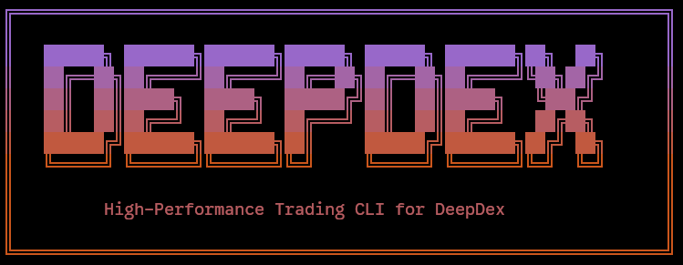

# DeepDEX CLI



A high-performance CLI trading bot and utility suite for the DeepDex protocol. Trade spot and perpetual markets, manage subaccounts, and run automated strategies on the DeepDex Testnet.

## Install

### Quick Install (Recommended)

```bash
curl -fsSL https://raw.githubusercontent.com/deepdexfinance/deepdex-cli/main/install.sh | bash
```

Or with wget:

```bash
wget -qO- https://raw.githubusercontent.com/deepdexfinance/deepdex-cli/main/install.sh | bash
```

### Manual Install

```bash
git clone https://github.com/deepdexfinance/deepdex-cli.git ~/.deepdex
cd ~/.deepdex
bun install
```

### Uninstall

```bash
~/.deepdex/install.sh --uninstall
```

## Quick Start

```bash
# Initialize wallet
deepdex init

# Get testnet tokens
deepdex faucet

# Create a subaccount and deposit
deepdex account create
deepdex account deposit 1000 USDC
deepdex account deposit 50% ETH    # Deposit 50% of wallet balance

# Start trading (supports % amounts)
deepdex spot buy ETH/USDC 0.5
deepdex spot buy ETH/USDC 50%      # Buy with 50% of USDC balance
deepdex perp long ETH-USDC 1 --lev 10
deepdex perp long ETH-USDC 25% --lev 5  # Use 25% of margin at 5x

# Run automated bot (foreground)
deepdex bot start grid

# Or use process manager for multiple bots (background)
deepdex pm start eth-grid grid --config ./configs/grid.json
deepdex pm start btc-dca simple --config ./configs/dca.json
deepdex pm ps  # List all running processes
```

## 🔐 Automation & Scripting

For non-interactive use (CI/CD, scripts, multiple bots):

```bash
# Create wallets programmatically
DEEPDEX_NEW_WALLET_PASSWORD="mypassword" deepdex wallet create bot-1
# Or use --password flag
deepdex wallet create bot-2 --password mypassword

# Unlock wallet from env for transactions
export DEEPDEX_WALLET_PASSWORD="mypassword"
deepdex wallet transfer 100 USDC bot-1 --yes
deepdex account deposit 100% USDC --yes

# Start bot processes in background
deepdex pm start my-bot momentum --config ./config.json --yes
```

**Environment Variables:**
| Variable | Description |
|----------|-------------|
| `DEEPDEX_WALLET_PASSWORD` | Password for unlocking existing wallets |
| `DEEPDEX_NEW_WALLET_PASSWORD` | Password for creating/importing wallets |
| `DEEPDEX_NON_INTERACTIVE` | Set to "true" to fail instead of prompting |

## 🚀 Features

- **Multi-Market Support**
  - Spot Trading: ETH/USDC, SOL/USDC with limit and market orders
  - Perpetual Futures: Up to 50x leverage with TP/SL orders

- **Order Management**
  - Limit, Market, Post-Only, Reduce-Only orders
  - Integrated Take-Profit and Stop-Loss
  - Batch order cancellation

- **Account System**
  - Subaccount isolation for different strategies
  - Hot wallet delegation for bot trading
  - Margin trading support

- **Automated Trading**
  - Grid, Market Making, and Arbitrage strategies
  - Real-time Oracle price feeds
  - Backtesting support

- **Process Manager** (`pm`)
  - Run multiple bots simultaneously with unique names
  - PM2/Docker Compose style management
  - Per-process logs and monitoring

### 🤖 Strategies

The bot comes with several built-in strategies that can be configured in `.deepdex/config.json`:

1.  **Simple DCA (`simple`)**
    *   Executes dollar-cost averaging by buying a fixed amount of an asset at regular intervals.
    *   Good for long-term accumulation.

2.  **Grid Trading (`grid`)**
    *   Places buy and sell orders at fixed price intervals within a configured range.
    *   **Inventory Skewing**: Automatically adjusts grid levels based on current inventory to manage risk (e.g., shifts levels down if holding too much inventory).
    *   Best for sideways/ranging markets.

3.  **Momentum (`momentum`)**
    *   Trend-following strategy using Moving Averages (MA).
    *   Longs when price is above MA, shorts when below.
    *   Captures big trends but may suffer in choppy markets.

4.  **Funding Rate Arbitrage (`arbitrage`)**
    *   Exploits positive funding rates by shorting the perpetual contract and buying the spot asset (Delta Neutral).
    *   Earns funding fees while hedging price risk.
    *   Automatically sells spot position when closing the arbitrage.

- **Automation & Scripting**
  - Non-interactive wallet creation with `--password` flag
  - Environment variables for password handling
  - Batch operations with `--yes` flag
  - JSON output for scripting

- **Developer Experience**
  - Built with [Bun](https://bun.sh) for speed
  - Type-safe with TypeScript + Zod
  - JSON output mode for scripting

## 📖 Documentation

See [GUIDE.md](./GUIDE.md) for complete CLI reference and command documentation.

## 🛠 Tech Stack

| Component | Technology |
|-----------|------------|
| Runtime | [Bun](https://bun.sh) |
| Language | TypeScript |
| Blockchain | [viem](https://viem.sh) |
| Validation | [zod](https://zod.dev) |

## 📂 Project Structure

```
deepdex/
├── src/
│   ├── abis/          # Contract ABIs
│   ├── config/        # Configuration
│   ├── services/      # Business logic
│   └── types/         # TypeScript types
├── index.ts           # Entry point
├── GUIDE.md           # CLI documentation
└── README.md
```

## ⚡ Development

### Prerequisites

- [Bun](https://bun.sh) v1.0.0+

### Setup

```bash
git clone https://github.com/deepdex/deepdex.git
cd deepdex
bun install
```
### Run

```bash
bun run start
```

## 🔗 Network

| Property | Value |
|----------|-------|
| RPC URL | `https://rpc-testnet.deepdex.finance` |
| Network | DeepDex Testnet |

## 🤝 Contributing

1. Fork the project
2. Create feature branch (`git checkout -b feature/amazing`)
3. Commit changes (`git commit -m 'Add amazing feature'`)
4. Push to branch (`git push origin feature/amazing`)
5. Open a Pull Request

## 📄 License

MIT
